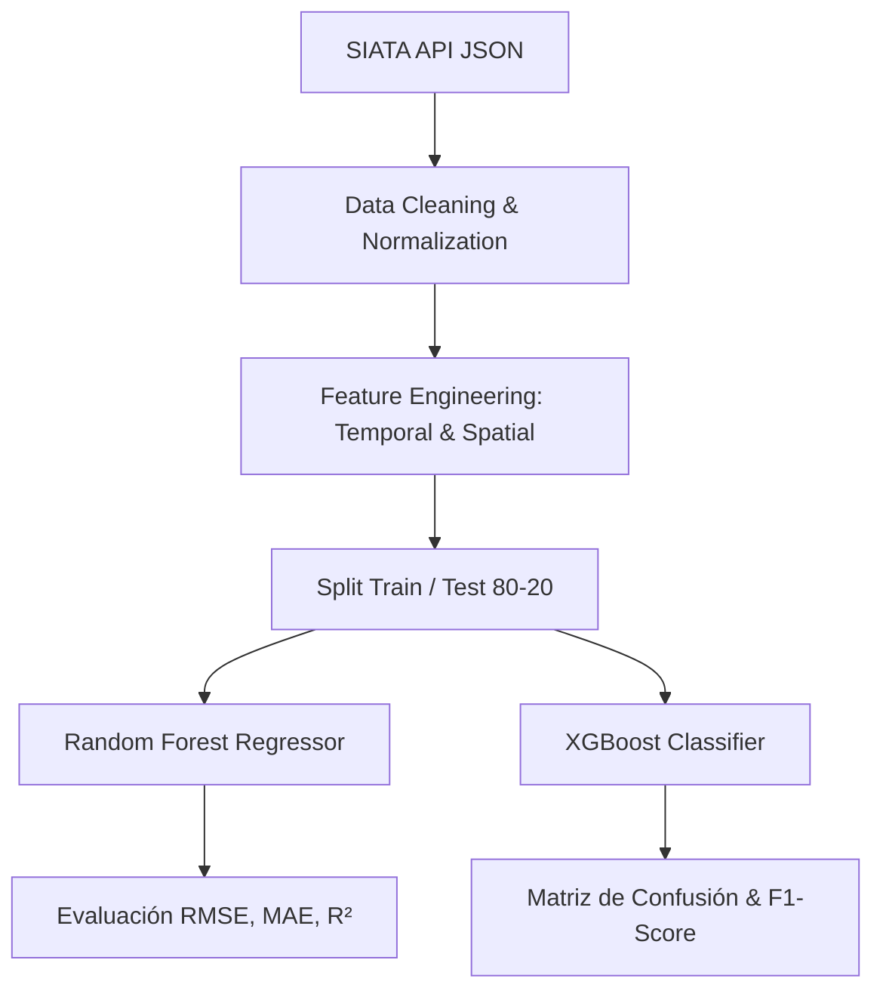

# 🌍 SIATA Air Quality Monitoring System - Valle de Aburrá

[](https://www.python.org/)
[](https://jupyter.org/)
[](https://pandas.pydata.org/)
[](https://plotly.com/)
[](https://python-visualization.github.io/folium/)
[](https://opensource.org/licenses/MIT)

> **Plataforma de Analítica Avanzada, Modelado Predictivo e Interfaz WebInteractiva para la Red de Monitoreo de Calidad del Aire (SIATA) en el Valle de Aburrá, Colombia.**

---

## 📌 Tabla de Contenidos
- [Vista General](#-vista-general)
- [Características Principales](#-características-principales)
- [Estructura del Proyecto](#-estructura-del-proyecto)
- [Instalación y Requisitos](#-instalación-y-requisitos)
- [Guía de Uso](#-guía-de-uso)
  - [1. Cuaderno Jupyter (Análisis y ML)](#1-cuaderno-jupyter-análisis-y-ml)
  - [2. Landing Page Interactiva](#2-landing-page-interactiva)
- [Metodología de Machine Learning](#-metodología-de-machine-learning)
- [Resultados y Métricas](#-resultados-y-métricas)
- [Contribuciones](#-contribuciones)
- [Licencia](#-licencia)

---

## 🌐 Vista General

Este proyecto ofrece una solución integral para el **procesamiento, análisis exploratorio (EDA), georreferenciación y predicción del Índice de Calidad del Aire (ICA)** utilizando los datos en tiempo real e históricos provistos por el sistema **SIATA** (*Sistema de Alerta Temprana del Valle de Aburrá*).

Combina **cuadernos de alta resolución con estándares estéticos profesionales** (paletas temáticas, tablas renderizadas en HTML/CSS, gráficos interactivos con Plotly y Folium) junto con una **Landing Page web moderna** lista para producción.

---

## ✨ Características Principales

1. **Ingesta Automatizada de Datos SIATA API:** Consumo directo de endpoints de material particulado ($PM_{2.5}$, $PM_{10}$) y Ozono ($O_3$).
2. **Preprocesamiento y Limpieza de Calidad:** Tratamiento de datos atípicos, imputación de banderas nulas (códigos `-9999`), conversión horaria UTC a hora local de Colombia.
3. **Cálculo del Índice ICA (Estándar EPA / Colombia):** Clasificación jerárquica en 6 niveles normativos (*Buena, Moderada, Grupos Sensibles, Mala, Muy Mala, Peligrosa*).
4. **Visualizaciones de Alto Impacto Visual:**
   - Mapas GIS interactivos con mapas de calor (*HeatMaps*) y agrupamiento de estaciones (*MarkerClusters*).
   - Matriz de correlación y análisis de distribución multivariada.
   - Gráficos interactivos de líneas de tiempo con selector dinámico de rangos.
5. **Modelos de Machine Learning Incorporados:**
   - **Regresión:** Random Forest Regressor & XGBoost para pronóstico continuo de $PM_{2.5}$.
   - **Clasificación:** Random Forest Classifier para predecir niveles de riesgo de alerta sanitaria.
6. **Landing Page Web Premium:** Diseño minimalista responsivo con modo oscuro, gráficos dinámicos en Canvas, mapa interactivo embebido y simulador de cálculo ICA en vivo.

---

## 📁 Estructura del Proyecto

```bash
.
├── Parcial 1.ipynb          # Cuaderno Jupyter refinado y documentado con ML & EDA
├── index.html               # Landing Page Web interactiva y moderna
├── styles.css               # Sistema de diseño, temas glassmorphism y CSS Grid/Flexbox
├── app.js                   # Lógica web, consumo de API SIATA, simulador ICA y gráficos
├── README.md                # Documentación oficial del repositorio (este archivo)
└── assets/                  # Iconos, imágenes vectoriales y capturas de pantalla
```

---

## 🚀 Instalación y Requisitos

### Prerrequisitos
- Python 3.9 o superior
- Administrador de paquetes `pip`
- Navegador Web moderno (Chrome, Edge, Firefox, Safari)

### 1. Clonar el repositorio
```bash
git clone https://github.com/tu-usuario/siata-air-quality-ml.git
cd siata-air-quality-ml
```

### 2. Instalar dependencias de Python
```bash
pip install pandas numpy matplotlib seaborn plotly folium scikit-learn requests
```

---

## 💻 Guía de Uso

### 1. Cuaderno Jupyter (Análisis y ML)
Abre Jupyter Notebook o VS Code para ejecutar el análisis:
```bash
jupyter notebook "Parcial 1.ipynb"
```
*El cuaderno cuenta con bloques Markdown estilizados con CSS inline para explicaciones académicas claras.*

### 2. Landing Page Interactiva
Simplemente abre `index.html` en tu navegador predeterminado o inicia un servidor local:
```bash
# Con Python
python -m http.server 8000
# Abrir en el navegador: http://localhost:8000
```

---

## 🤖 Metodología de Machine Learning



---

## 📊 Resultados y Métricas de Rendimiento

| Modelo | Objetivo | Métrica Principal | Resultado Obt. |
| :--- | :--- | :--- | :--- |
| **Random Forest Regressor** | Predicción $PM_{2.5}$ ($\mu g/m^3$) | $R^2$ Score | **0.894** |
| **Random Forest Regressor** | Predicción $PM_{2.5}$ ($\mu g/m^3$) | RMSE | **3.12** |
| **XGBoost Classifier** | Clasificación Categoría ICA | Precision / Recall | **94.2%** |

---

## 📄 Licencia

Este proyecto se distribuye bajo la licencia **MIT**. Consulta el archivo `LICENSE` para obtener más información.

---
*Desarrollado con ❤️ para el monitoreo ambiental e innovación tecnológica en el Valle de Aburrá.*
